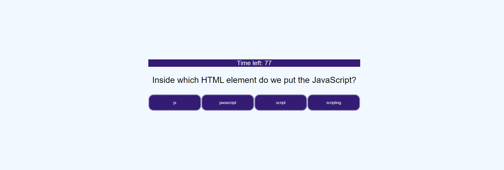

# JavaScript-Quiz

## JavaScript-Quiz with a timer function and an array of 7 questions.
Test your JavaScript knowladge with this short quiz, there are 7 questions and you have 90 seconds to answer, save your score at the end with your initials.
The website was created to replicate a standard layout provided by the course with a rstriction on the softaware used.

## Technologies 
* HTML5
* CSS
* JavaScript
No external APIs used during this project.

Link to website: https://anaumov1.github.io/code-quiz/

## Table of contents
* [Installation](#installation)
* [Usage](#usage)
* [Credits](#credits)
* [License](#license)

## Installation

To install all the files for the "JavaScript Quiz" website please clone this https://github.com/anaumov1/code-quiz.git repository to your computer. For instructions on how to clone a repository from GitHub follow this link: https://docs.github.com/en/github/creating-cloning-and-archiving-repositories/cloning-a-repository

## Usage

"JavaScript Quiz" is a simple quiz webite with limited capabilities. Once ou navigate to the website click on "Start JavaScript Quiz" button to initialize the quiz or "High Scores" to view high score.
After initializing the quiz you will be przented with a series of questions and answer choises, click on the answer you believe to be correct, and alert window will inform you if your answer was correct or not. After answering all questions you will be offerd to save your score (each correct answer equals 1 point), you can save your score or choose to start the quiz over.

## Credits
The project was completed by Alexandru Naumov, special thanks to UT Bootcamp instructor and TA's for the assistance provided for this website.

## Licence

Copyright (c) [2021] [Alexandru Naumov]

Permission is hereby granted, free of charge, to any person obtaining a copy
of this software and associated documentation files (the "Software"), to deal
in the Software without restriction, including without limitation the rights
to use, copy, modify, merge, publish, distribute, sublicense, and/or sell
copies of the Software, and to permit persons to whom the Software is
furnished to do so, subject to the following conditions:

The above copyright notice and this permission notice shall be included in all
copies or substantial portions of the Software.

THE SOFTWARE IS PROVIDED "AS IS", WITHOUT WARRANTY OF ANY KIND, EXPRESS OR
IMPLIED, INCLUDING BUT NOT LIMITED TO THE WARRANTIES OF MERCHANTABILITY,
FITNESS FOR A PARTICULAR PURPOSE AND NONINFRINGEMENT. IN NO EVENT SHALL THE
AUTHORS OR COPYRIGHT HOLDERS BE LIABLE FOR ANY CLAIM, DAMAGES OR OTHER
LIABILITY, WHETHER IN AN ACTION OF CONTRACT, TORT OR OTHERWISE, ARISING FROM,
OUT OF OR IN CONNECTION WITH THE SOFTWARE OR THE USE OR OTHER DEALINGS IN THE
SOFTWARE.
